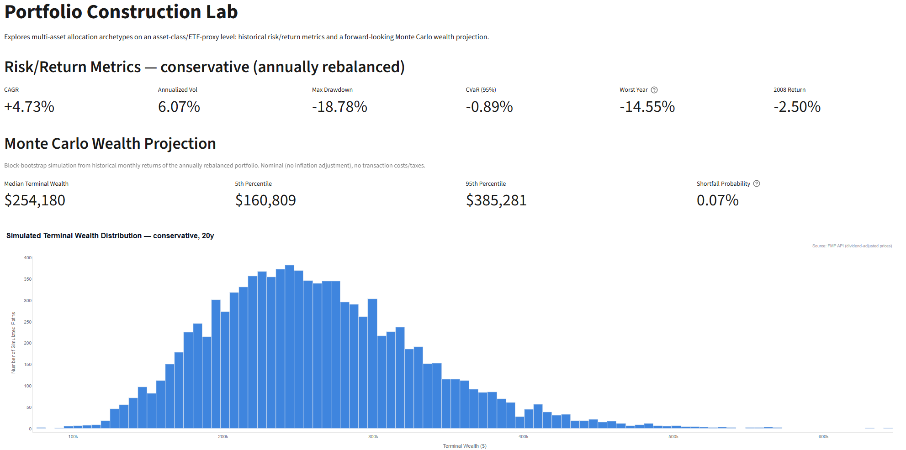
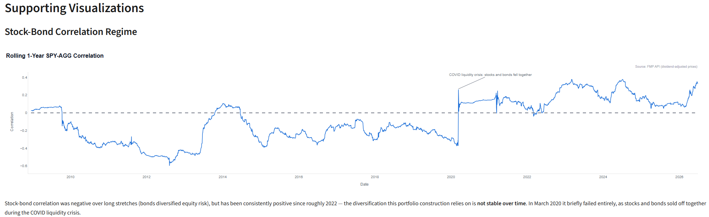
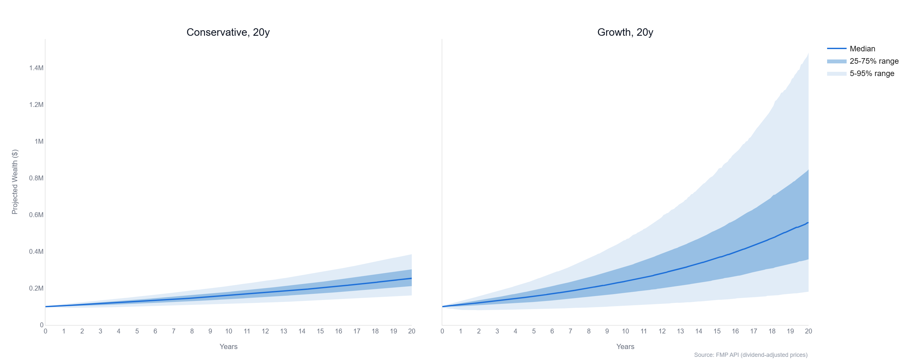

# Portfolio Construction Lab

[](https://github.com/carlos-schwiening/portfolio-construction-lab/actions/workflows/ci.yml)

An interactive Streamlit dashboard for multi-asset portfolio construction and risk analysis, built during my MSc in Accounting, Finance & Controlling.

Pick one of four allocation archetypes — conservative through growth, defined at asset-class level from investable ETF proxies — and the dashboard answers three questions for it:

- What has its historical risk/return profile actually been?
- How much does annual rebalancing change that profile, in both directions?
- What does a block-bootstrapped Monte Carlo say about a given capital over a given horizon?

Every metric is computed from real dividend-adjusted ETF price history. Nothing here is estimated or copied from a third-party source.

---

## Approach

Each archetype is a set of target weights across nine ETF-proxy buckets (US/non-US/EM equities, core bonds, long treasuries, high yield, EM bonds, TIPS, cash), built on the asset-class structure of S. Page, "Beyond Diversification" (2021), chapter 17 — the archetype concept is an inspiration for this project's structure, not a reproduction of the book's proprietary Barra/CMA-based return figures. Every number in this README is computed independently from real ETF price history.

The common backtest window is determined at runtime from the data itself (the latest inception date across the nine proxies), not hardcoded — it currently starts 2007-12-19 and runs to today (~18.5 years, 4,658 trading days), bounded by the youngest bond proxies (EMB, BIL). All prices are dividend-adjusted (total return), which matters most for the bond sleeves, where most of the historical return comes from distributions rather than price appreciation. Real Assets and Alternatives are intentionally left out of the active universe — no clean, low-cost ETF proxy with sufficient history exists for either — and the remaining bucket weights are renormalized accordingly.

**[SOURCES.md](SOURCES.md)** documents every source individually — what each one is used for, how to check it, and the limits that actually constrain the results: the 5,000-row cap that truncates silently, why the prices have to be dividend-adjusted, why QAI's 2009 inception would have dragged the window onto the market bottom, and what the one forward-looking lever in the simulation does (it is zero by default).

---

## Dashboard



The example above shows the conservative archetype with a $100,000 start capital over a 20-year horizon. The main view shows that archetype's historical risk/return metrics (annually rebalanced) as headline figures, followed by the Monte Carlo terminal-wealth projection for the chosen capital and horizon, with the simulated wealth distribution plotted as a histogram. A second section below (not shown here) adds the stock-bond correlation regime chart, a buy-and-hold-vs-rebalanced comparison, and a return-assumption sensitivity check.

---

## Key Results

All figures are annually rebalanced, computed over the full common backtest window (2007-12-19 to today).

| Archetype | Equity % | CAGR | Vol | Max DD | VaR 95% (daily) | CVaR 95% (daily) | Worst Year | 2008 |
|---|---:|---:|---:|---:|---:|---:|---:|---:|
| conservative | 12.5% | 4.73% | 6.07% | -18.78% | -0.52% | -0.89% | 2022 (-14.55%) | -2.50% |
| moderate | 45.9% | 6.34% | 9.51% | -28.03% | -0.89% | -1.45% | 2008 (-15.07%) | -15.07% |
| balanced | 70.1% | 7.13% | 14.11% | -41.61% | -1.29% | -2.16% | 2008 (-26.24%) | -26.24% |
| growth | 84.3% | 8.67% | 16.59% | -47.31% | -1.51% | -2.55% | 2008 (-31.18%) | -31.18% |

CAGR, volatility and max drawdown rise monotonically from conservative to growth, as the equity share goes from 12.5% to 84.3%. Expected, and not the interesting part.

**The Worst Year column is.** conservative's worst calendar year was 2022 (-14.55%), not 2008 (-2.50%) — while moderate, balanced and growth all had theirs in 2008. That is a regime difference rather than a coincidence: in 2008 bonds rallied as a flight-to-quality asset and cushioned conservative's heavy fixed-income weight while equities cratered; in 2022 bonds and equities sold off together (the correlation breakdown documented below), so the same bond-heavy construction offered no cushion and lost more than in the supposedly worse crisis.

The column is variant-dependent, though. Under buy-and-hold, moderate's worst year is also 2022 (-16.14%) rather than 2008 — drifting weights had let its equity share grow, changing which crisis hurt most.

---

## Allocation Archetypes

Four fixed sets of target weights across the nine active buckets. Normalized weights (%):

| Bucket | conservative | moderate | balanced | growth |
|---|---:|---:|---:|---:|
| SPY (US Stocks) | 12.50 | 31.76 | 36.78 | 59.55 |
| EFA (Non-US Developed) | 0.00 | 11.76 | 28.74 | 21.35 |
| EEM (EM Stocks) | 0.00 | 2.35 | 4.60 | 3.37 |
| AGG (Core Bonds) | 53.00 | 32.94 | 18.39 | 12.36 |
| TLT (Long Treasury) | 4.00 | 2.35 | 1.15 | 1.12 |
| HYG (High Yield) | 18.50 | 4.71 | 2.30 | 1.12 |
| EMB (EM Bond) | 10.00 | 5.88 | 4.60 | 1.12 |
| TIP (TIPS) | 2.00 | 0.00 | 3.45 | 0.00 |
| BIL (Cash) | 0.00 | 8.24 | 0.00 | 0.00 |

Real Assets and Alternatives (QAI as a rough HFRI proxy) are excluded from this active set: QAI's ETF inception (2009-03) lands in the depths of the financial crisis, which would have pulled the common backtest window two years later and biased it toward a market trough, so it was left out of v1 and the remaining weights renormalized. Real Assets candidates (VNQ, GLD, XLE, DBC) were audited for data availability but never had a clean single proxy to begin with, so no design decision was made on them.

---

## Risk Engine

All metrics come straight from daily dividend-adjusted ETF returns:

| Metric | How it is computed |
|--------|--------------------|
| CAGR | from the cumulative total-return path |
| Volatility | std. dev. of daily returns × √252 |
| Max drawdown | largest peak-to-trough decline of that path |
| VaR 95% | empirical 5th-percentile daily return |
| CVaR 95% | mean of the returns at or below that percentile |

Two construction variants run side by side: **buy-and-hold**, where weights start at target and drift with performance, and **annually rebalanced**, where they reset on the first trading day of each calendar year using only prior-day information — no lookahead. Neither models transaction costs or taxes.

| Archetype | Vol (BH) | Vol (Rebalanced) | Max DD (BH) | Max DD (Rebalanced) | CAGR (BH) | CAGR (Rebalanced) |
|---|---:|---:|---:|---:|---:|---:|
| conservative | 6.57% | 6.07% | -19.54% | -18.78% | 5.25% | 4.73% |
| moderate | 10.34% | 9.51% | -25.95% | -28.03% | 7.09% | 6.34% |
| balanced | 14.20% | 14.11% | -39.94% | -41.61% | 7.72% | 7.13% |
| growth | 16.82% | 16.59% | -46.20% | -47.31% | 9.23% | 8.67% |

Rebalancing lowers volatility for every archetype, consistently. Max drawdown, however, is not uniformly improved: it gets shallower under rebalancing for conservative but deepens for moderate, balanced, and growth. This is a real, explainable effect, not noise — annual rebalancing forces a buy back into an asset class that has just fallen, which helps when that asset class subsequently recovers but compounds the loss further if the decline is part of a longer drawdown spanning the rebalancing date. There is deliberately no blanket "rebalancing reduces risk" claim here; the honest finding is that it reduces average volatility reliably while its effect on tail/drawdown risk depends on the path.

---

## Stock-Bond Correlation Regime



The rolling 1-year correlation between SPY and AGG was negative across most of 2010-2021 — the textbook stock-bond diversification the four archetypes' bond sleeves are built around — but has been consistently positive since roughly 2022, driven by the post-2021 rate-hiking cycle that pushed stocks and bonds to sell off together rather than offset each other. This is the project's central honest caveat: the diversification benefit these portfolios assume is not stationary over time.

March 2020 is the sharpest illustration of that instability and is annotated directly on the chart: during the acute COVID liquidity crisis, stocks and bonds briefly fell together for about a week (AGG fell on the same days SPY crashed, a "dash for cash" event), causing the 252-day rolling correlation to jump from roughly -0.37 to +0.26 within days, and to jump again about a year later when those same days rolled out of the window. Both jumps were checked against the underlying price data and are genuine market behavior, not a data gap or calculation artifact — confirmed by recomputing the same correlation purely from SPY and AGG's own joint price history, independent of the other seven buckets in the dashboard's universe.

---

## Monte Carlo Wealth Projection

The forward-looking projection is a block bootstrap, not a normal-distribution simulation: real asset returns are fat-tailed, and a normal distribution would understate tail risk. The annually rebalanced portfolio's daily returns are aggregated to monthly returns, then random blocks of six consecutive historical months are drawn (with replacement) and concatenated until the requested horizon is covered, preserving volatility clustering and crisis sequences (such as 2008 or March 2020) that an independent month-by-month draw would destroy. 10,000 paths are simulated with a fixed random seed for reproducibility. Results are nominal — no inflation adjustment — and assume no transaction costs or taxes.

Terminal wealth distribution, $100,000 start capital, 20-year horizon:

| Archetype | Median | P5 | P95 | Shortfall Probability |
|---|---:|---:|---:|---:|
| conservative | $254,180 | $160,809 | $385,281 | 0.07% |
| moderate | $350,518 | $179,055 | $637,367 | 0.17% |
| balanced | $415,413 | $153,986 | $987,215 | 1.13% |
| growth | $558,025 | $181,611 | $1,483,100 | 0.76% |

growth's shortfall probability (0.76%) is lower than balanced's (1.13%) despite growth being the riskier portfolio by volatility and max drawdown; over this specific backtest window, growth's higher average return compounds enough over 20 years to outweigh its higher volatility, an effect amplified by balanced being heavily overweight EFA (non-US developed equities), which underperformed across this particular sample period — a window-specific result, not a general claim that growth is the safer archetype.

The historical mean used for the table above is itself an assumption worth stress-testing: the 2007-today window contains an unusually strong bond bull market (a multi-decade decline in interest rates), so the historical average return is plausibly optimistic for the next 20 years. Applying a 2 percentage point annual return haircut to the balanced archetype moves the median terminal wealth from $415,413 to $278,947 and the P5 outcome from $153,986 to $103,234, while the shortfall probability rises from 1.13% to 4.43% — roughly a fourfold increase from a comparatively small annual assumption change. Monte Carlo output here should be read as a distribution conditional on a specific historical-mean assumption, not a forecast.

### Wealth Projection Over Time



The terminal wealth table above shows only the destination; this chart shows the path. For each archetype, the same 10,000 simulated paths are summarized at every month into percentile bands instead of a single endpoint: an outer band spanning the 5th-95th percentile, an inner band spanning the 25th-75th percentile, and a median line as an orientation anchor. These bands are percentile envelopes across all paths at each point in time, not individual simulated paths — a single real path can and does move between percentiles over its own 20-year run rather than tracking one band the whole way, which is a methodological nuance worth stating plainly rather than letting the chart imply otherwise.

The chart above puts conservative and growth side by side on one shared y-axis specifically so the difference in how fast uncertainty grows is comparable rather than an artifact of each panel auto-scaling to its own range: conservative's funnel stays narrow across the full 20 years, while growth's fans out substantially faster, in both directions. The table below quantifies that gap at two points in the horizon.

| Archetype | Year 10 spread (P5-P95) | Year 20 spread (P5-P95) |
|---|---:|---:|
| conservative | $97,991 | $224,473 |
| moderate | $167,363 | $458,312 |
| balanced | $273,371 | $833,229 |
| growth | $356,701 | $1,301,488 |

For every archetype the spread more than doubles from year 10 to year 20, and growth's year-20 spread is nearly six times conservative's — the range of plausible outcomes widens with both time and equity share, not just one or the other.

The same caveat from the table above applies here, and is more visible in this chart than in any single number: the funnel widens upward over time, and even the 5th-percentile (lower) edge of each band rises rather than staying flat, both of which lean on the optimistic historical return assumption discussed above (the 2007-today bond bull market). In a less favorable forward regime, the lower edge of the funnel would plausibly sit flatter, or decline, rather than climbing alongside the median. This chart is a conditional distribution under the historical-mean assumption, not a forecast of what will happen.

---

## Limitations

- **The window is bounded by ETF inception, not by the asset classes.** 2007-12-19 is when the youngest proxy (EMB) began trading — core bonds, US equities and EM equities could each be analysed much further back.
- **Every bucket is one liquid ETF, not the index it stands for**, which introduces tracking error the engine does not separately quantify.
- **Real Assets and Alternatives are absent from the active universe**, so no figure here reflects the inflation-hedging or alternative-strategy exposure a real allocation might carry.
- **Monte Carlo results are nominal, not inflation-adjusted.** Over a 20-year horizon that is a material simplification, not a rounding error.
- **The bootstrap assumes the return distribution is stationary going forward.** It preserves the clustering and fat tails in the sample — the stock-bond correlation flip above is in there — but it cannot produce a regime that never occurred in the window it draws from.

---

## Tech Stack

Python 3.12+ (CI runs 3.12 and 3.13) · pandas · numpy · streamlit · plotly · SQLite

```bash
git clone https://github.com/carlos-schwiening/portfolio-construction-lab
cd portfolio-construction-lab
pip install -e .
streamlit run app.py
```

- `pip install -e .` installs the project as a package, so `from core.risk_engine import ...` works without path hacks. `pip install -r requirements.txt` also works if you would rather not install the package.
- The dashboard reads a local SQLite database, `data/portfolio_data.db`, which is **not** in this repository.
- To populate it: set an FMP API key and run `python data/db_pull_v1.py`. The pull uses `data/fmp_client.py`, self-contained for the two price endpoints it needs, so a fresh clone reaches nothing outside the repo.

A paid FMP key is required for that pull — the free tier answers the price endpoints with HTTP 402.

## Verifying the published figures

```bash
python verify.py            # structural facts and allocation properties
python verify.py --full     # also recomputes from data/portfolio_data.db
```

Nine checks. A number in a README has no link to the code that made it — this
one named the mypy scope as `core/` after `reporting/` had been added.

- **Structural** — test count against `pytest`, documented mypy scope against the workflow, the four archetypes against the code
- **Properties** — every archetype's weights sum to 1.0, QAI appears in none of them, the bootstrap draws six-month blocks, the return haircut defaults to zero
- **From the data** (`--full`) — the window start and the trading-day count, derived from the database rather than read from the README

The window start is the interesting one: the README claims it is *derived*, not
chosen. `verify.py` derives it the same way — latest inception among the proxies
in use — and gets 2007-12-19 with 4,658 trading days.

## Tests & Continuous Integration

[GitHub Actions](.github/workflows/ci.yml) runs on every push to `main`: **20 tests** (`python -m pytest`) plus **mypy** over `core/` and `reporting/`. Five of those tests need the price database and skip cleanly when it is absent, so a fresh checkout without `data/portfolio_data.db` — the CI case — runs 15 and skips the Monte Carlo module rather than failing on a missing file.

`core/` holds pure calculation code — values in, values out, no database and no
network — which is what makes it testable in isolation. Deterministic measures
are checked against known values (maximum drawdown, VaR/CVaR 95%, the missing
2008 return). The Monte Carlo engine is tested on properties instead: identical
output under a fixed seed, terminal wealth scaling linearly with start capital,
a return haircut lowering the median outcome, and percentile paths starting at
the initial capital in the correct order. The rebalancing logic is pinned by
tests showing that buy-and-hold weights drift while annual rebalancing resets
them at the year boundary — and that both agree before the first boundary.

Both checks run in a clean environment on Ubuntu with Python 3.12, so a package
that happens to be installed locally cannot hide a missing entry in
`pyproject.toml`.

---

## Data

Daily dividend-adjusted (total return) ETF prices are sourced from the Financial Modeling Prep (FMP) API and cached locally in a SQLite database (`data/portfolio_data.db`), built once via `data/db_pull_v1.py` and read by the dashboard and the risk/Monte Carlo engines on every run. No API key and no database file are included in this repository — the key is read from a local `Config/Api_keys.py` file excluded via `.gitignore`, and the database is excluded the same way since it is fully reproducible from the FMP API.

---

## Author

Carlos Schwiening — MSc Accounting, Finance & Controlling
GitHub: [carlos-schwiening](https://github.com/carlos-schwiening)

---

## References

Page, Sébastien (2021): Beyond Diversification: What Every Investor Needs to Know About Asset Allocation. New York: McGraw Hill. — Inspiration for the four allocation archetypes' asset-class structure (chapter 17, Sample Portfolios); no figures in this project are reproduced from the book, all metrics are independently computed from real ETF price history.

Efron, Bradley; Tibshirani, Robert J. (1993): An Introduction to the Bootstrap. New York: Chapman & Hall/CRC. — Methodological basis for the block bootstrap used in the Monte Carlo projection.

Jorion, Philippe (2006): Value at Risk: The New Benchmark for Managing Financial Risk. 3rd ed. New York: McGraw-Hill. — Methodological basis for the VaR/CVaR calculations.
